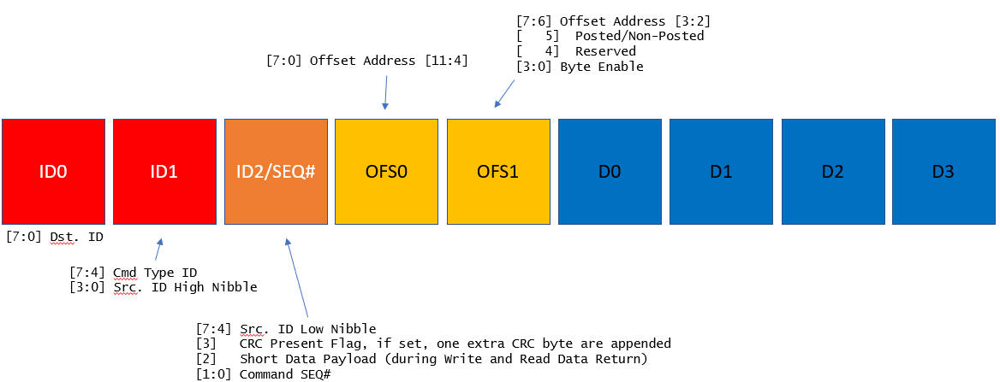
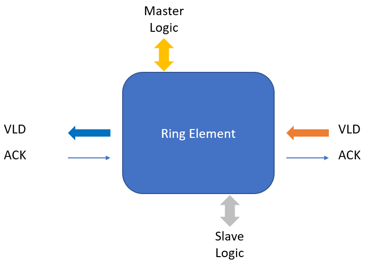

# RING_BUS

A ring bus is an low-bandwidth message forwarding mechanism between initiator(normally CPU) and target(normally I/O devices).
it was designed to resolve routing resouce issue of an SOC chip by replacing hierachical fan-out structure bus to peer-to-peer daisy chain structure bus. It improve routing efficiency and also timing closure especially on FPGA implementation.
## Features
   * support multi-master
   * support bit-level set/clear (bit-banding)
   * support outstanding request
   * pipeline insertion between ring member allowed
   * small P&R footprint
   
## Target application
   * low-bandwidth data transfer within SOC
   * latency insensitive event passing like software register access, status update, interrupt & acknowledge, IPC etc.
   
## Top Architecture
* four ring members case

## Protocol between Ring Member

## Message Type

## Message Structure

 * Generic Structure (Generic)

 * Request Type (Register Read, Bit Set/Clear)

 

 * Request Type (Register Write, Interrupt Request, Peer-to-Peer Message)

 

 * Request Type (Set Member ID)
 
 
 
 * Respose Type (Register Read Data Return (4 Bytes, 1 Bytes, 16 Bytes)
 
 
 
 * Respose Type (Write Complte or Bit Set/Clear Status, Interrupt Acknowledge)

 
 
## Ring Member Interface
 
 
 
## Ring Member Internal Structure
 
 
 

   
   
